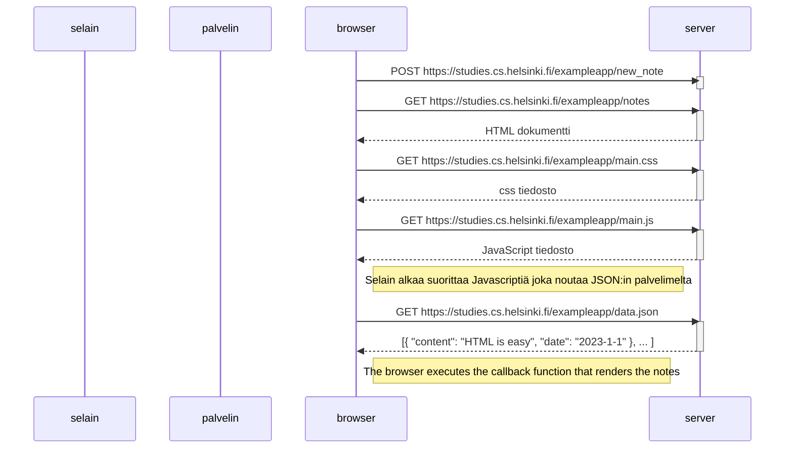

```mermaid
sequenceDiagram
    participant selain
    participant palvelin

    browser->>server: POST https://studies.cs.helsinki.fi/exampleapp/new_note
    activate server
    deactivate server
    
    browser->>server: GET https://studies.cs.helsinki.fi/exampleapp/notes
    activate server
    server-->>browser: HTML dokumentti
    deactivate server
    
    browser->>server: GET https://studies.cs.helsinki.fi/exampleapp/main.css
    activate server
    server-->>browser: css tiedosto
    deactivate server
    
    browser->>server: GET https://studies.cs.helsinki.fi/exampleapp/main.js
    activate server
    server-->>browser: JavaScript tiedosto
    deactivate server
    
    Note right of browser: Selain alkaa suorittaa Javascriptiä joka noutaa JSON:in palvelimelta
    
    browser->>server: GET https://studies.cs.helsinki.fi/exampleapp/data.json
    activate server
    server-->>browser: [{ "content": "HTML is easy", "date": "2023-1-1" }, ... ]
    deactivate server    

    Note right of browser: The browser executes the callback function that renders the notes 
```