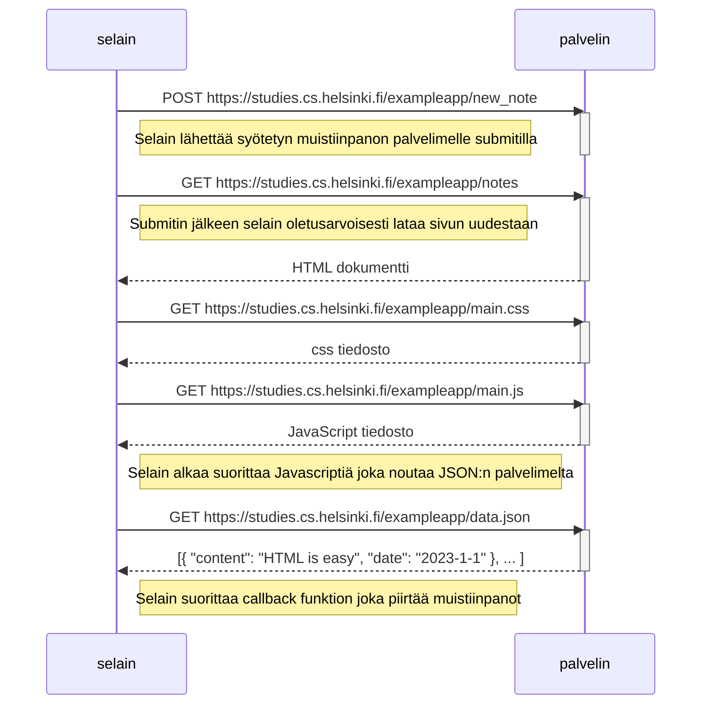

```mermaid
sequenceDiagram
    participant selain
    participant palvelin

    selain->>palvelin: POST https://studies.cs.helsinki.fi/exampleapp/new_note
    activate palvelin

    Note right of selain: Selain lähettää syötetyn muistiinpanon palvelimelle submitilla

    deactivate palvelin
    
    selain->>palvelin: GET https://studies.cs.helsinki.fi/exampleapp/notes
    activate palvelin

    Note right of selain: Submitin jälkeen selain oletusarvoisesti lataa sivun uudestaan

    palvelin-->>selain: HTML dokumentti
    deactivate palvelin
    
    selain->>palvelin: GET https://studies.cs.helsinki.fi/exampleapp/main.css
    activate palvelin
    palvelin-->>selain: css tiedosto
    deactivate palvelin
    
    selain->>palvelin: GET https://studies.cs.helsinki.fi/exampleapp/main.js
    activate palvelin
    palvelin-->>selain: JavaScript tiedosto
    deactivate palvelin
    
    Note right of selain: Selain alkaa suorittaa Javascriptiä joka noutaa JSON:n palvelimelta
    
    selain->>palvelin: GET https://studies.cs.helsinki.fi/exampleapp/data.json
    activate palvelin
    palvelin-->>selain: [{ "content": "HTML is easy", "date": "2023-1-1" }, ... ]
    deactivate palvelin 

    Note right of selain: Selain suorittaa callback funktion joka piirtää muistiinpanot 
```